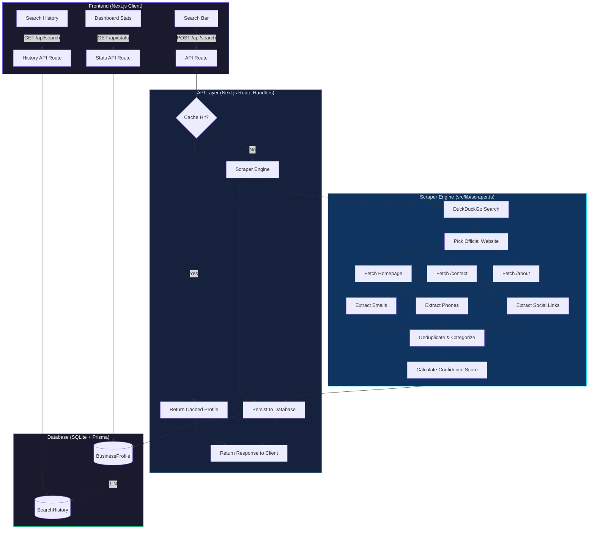

<div align="center">

# BizIntel

**Business Contact & Social Media Intelligence Platform**

Instantly discover verified business contacts, social media profiles, and official online presence from a single search.

[](https://nextjs.org)
[](https://react.dev)
[](https://www.typescriptlang.org)
[](https://www.prisma.io)
[](https://tailwindcss.com)

</div>

---

## Features

- **Web Scraping Engine** -- Crawls official websites, contact pages, and about pages to extract emails, phone numbers, and social links
- **DuckDuckGo Integration** -- Finds official websites via search without requiring API keys
- **Social Media Discovery** -- Detects profiles across 10 platforms (Facebook, Instagram, LinkedIn, X, TikTok, YouTube, Threads, Pinterest, GitHub, Medium)
- **Confidence Scoring** -- Assigns a 0-100 score based on data completeness and verification signals
- **Caching Layer** -- Stores results in SQLite via Prisma with a 24-hour TTL
- **Dashboard** -- Real-time stats on businesses found, emails, phones, and social accounts
- **Search History** -- Click any previous search to re-fetch instantly

## Architecture



## Tech Stack

| Layer | Technology |
|-------|-----------|
| Framework | Next.js 16 (App Router, Turbopack) |
| UI | React 19, Tailwind CSS 4 |
| Language | TypeScript 5 |
| Database | SQLite via Prisma ORM 6 |
| Scraping | Cheerio (HTML parsing), DuckDuckGo HTML search |
| Fonts | Inter + Outfit (Google Fonts) |

## Getting Started

### Prerequisites

- Node.js 18+ (recommended: 22)
- npm or yarn

### Installation

```bash
git clone https://github.com/your-username/extracter.git
cd extracter
npm install
```

### Database Setup

```bash
npx prisma generate
npx prisma db push
```

### Development

```bash
npm run dev
```

Open [http://localhost:3000](http://localhost:3000) in your browser.

### Production

```bash
npm run build
npm start
```

## Project Structure

```
extracter/
├── prisma/
│   └── schema.prisma          # Database schema (BusinessProfile, SearchHistory)
├── src/
│   ├── app/
│   │   ├── api/
│   │   │   ├── search/
│   │   │   │   └── route.ts   # POST search + GET history
│   │   │   └── stats/
│   │   │       └── route.ts   # GET dashboard statistics
│   │   ├── globals.css         # Global styles, glassmorphism theme
│   │   ├── layout.tsx          # Root layout with floating orbs
│   │   └── page.tsx            # Main search page + dashboard
│   ├── components/
│   │   └── SearchResult.tsx    # Result card with contacts, socials, confidence ring
│   └── lib/
│       ├── prisma.ts           # Prisma client singleton
│       └── scraper.ts          # Core scraping engine
├── package.json
└── README.md
```

## How It Works

1. **Search** -- User enters a company name, website, or email
2. **Discovery** -- DuckDuckGo locates the official website (skipping social media and directory sites)
3. **Extraction** -- The scraper fetches the homepage, `/contact`, and `/about` pages, parsing HTML with Cheerio
4. **Enrichment** -- Emails are categorized (general/support/sales), phone numbers extracted, and social profiles detected via regex
5. **Scoring** -- A confidence score (0-100) is calculated based on data completeness
6. **Storage** -- Results are persisted to SQLite; subsequent identical searches within 24 hours are served from cache

## API Reference

### `POST /api/search`

Search for a business profile.

**Request Body:**
```json
{ "query": "Vercel" }
```

**Response:**
```json
{
  "profile": { "companyName": "Vercel", "confidenceScore": 85, "verified": true, ... },
  "cached": false,
  "sourcesChecked": ["DuckDuckGo Search", "Official Website", "Contact Page"],
  "allEmails": ["info@vercel.com", "support@vercel.com"],
  "allPhones": ["+1-555-0100"]
}
```

### `GET /api/search`

Returns the 20 most recent search history entries.

### `GET /api/stats`

Returns aggregate statistics (total businesses, emails found, phones found, etc.).

## Environment Variables

No environment variables are required for basic functionality. The SQLite database is created automatically at `prisma/dev.db`.

## License

MIT
